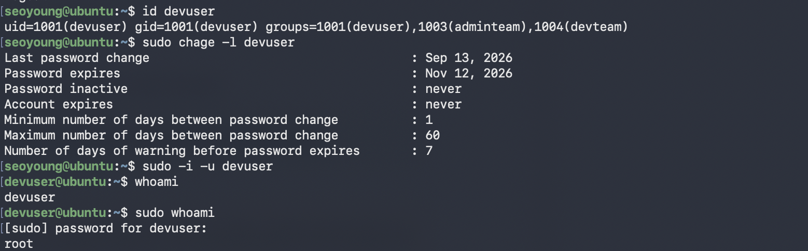

# Week 02 - Lab 02

## 실습 정보

- 발표자: 김기석
- 주제:
- 유형: 실습형

---

## 요구사항
1. devuser의 그룹 정보
2. 비밀번호 정책 1 / 60 / 7 
3. devuser → root → devuser가 확인되는 sudo 실행 결과


### 수행 결과



---

## Troubleshooting

### 문제

devuser의 비밀번호를 따로 설정하지 않아 비밀번호를 입력할 수 없었습니다.

### 원인

`useradd`로 생성한 계정은 비밀번호가 잠긴 상태(`/etc/shadow`의 비밀번호 필드가 `!`)로 만들어집니다.
`sudo -i -u devuser`로 전환하는 것은 root 권한을 경유하므로 대상 계정의 비밀번호가 필요 없었지만,
전환한 뒤 `sudo -l`, `sudo whoami`를 실행하려 할 때 문제가 발생했습니다.
sudo는 "전환할 대상"이 아니라 **명령을 실행하는 사용자 본인**의 비밀번호를 확인하기 때문에,
비밀번호가 잠긴 devuser로는 sudo 인증을 통과할 수 없었습니다.


### 해결

root 권한으로 devuser의 비밀번호를 설정한 뒤 다시 전환하여 검증을 진행했습니다.

```bash
# 해결 과정에서 사용한 명령어
```

---

## 배운 점

어떤 상황에 어떤 명령어를 사용해야 하는지는 대략적으로 익혔지만 옵션은 아직 헷갈리네요. 솔직히 몇 개는 컨닝을 했습니다...ㅎㅎ
익숙해지는 데 더 노력이 필요할 것 같습니다.
