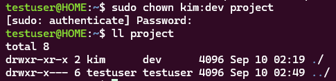
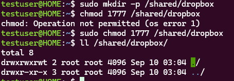

# Week 02 - Lab 01

## 실습 정보

- 발표자: 이주희
- 주제: 기본 파일 권한
- 유형: 실습형

---

## 문제

#### 1. 파일 권한 설정

숫자 모드로, `report.txt`를 소유자는 읽기/쓰기, 그룹과 기타는 읽기만 가능하게 설정하라.

#### 2. 소유자 및 소유 그룹 변경

`project/` 디렉터리의 소유자를 `kim`, 소유 그룹을 `dev`로 한 번에 바꿔라.

#### 3. 공동 디렉터리의 삭제 권한 설정

여러 사용자가 함께 쓰는 `/shared/dropbox`에서, 각자 자기 파일만 삭제할 수 있도록 설정하라.

### 수행 결과

문제에서 요구한 최종 상태가 정상적으로 적용되었는지 작성합니다.

이미지가 필요한 경우 `images/` 폴더에 저장한 뒤 첨부합니다.  
문제 1-1  
  
문제 1-2  
  
문제 1-3  
  
<!--
이미지 첨부 예시:

-->

---

<!--
문제가 더 있다면 아래 형식을 복사해서 추가하세요.

## 문제 N

> 문제 내용을 작성합니다.

### 수행 결과

문제에서 요구한 최종 상태가 정상적으로 적용되었는지 작성합니다.

이미지가 필요한 경우 `images/` 폴더에 저장한 뒤 첨부합니다.

이미지 첨부 예시:

---
-->

