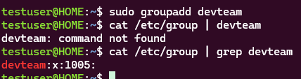
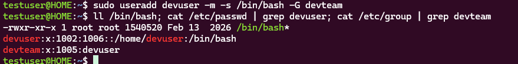
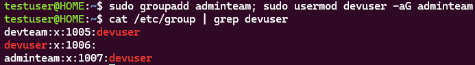
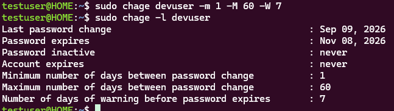
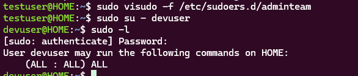

# Week 02 - Lab 02

## 실습 정보

- 발표자: 김기석
- 주제: 계정/그룹 관리
- 유형: 실습형

---

## 문제

#### 1. `devteam` 그룹을 생성하세요.
#### 2. `devuser` 사용자를 생성하세요. 홈 디렉터리가 있어야 하고, 로그인 셸은 `/bin/bash`, `devteam`은 보조 그룹
이어야 합니다.
#### 3. `adminteam` 그룹을 만들고, `devuser`가 기존 `devteam` 소속을 유지한 채 `adminteam`에도 속하도록 설
정하세요.
#### 4. `devuser`의 비밀번호 정책을 최소 1 일 / 최대 60 일 / 만료 전 경고 7 일로 설정하세요.
#### 5. `adminteam` 그룹 사용자가 sudo 를 통해 관리자 명령을 실행할 수 있도록 `/etc/sudoers.d/`에 별도 규칙을 구성하세요.
#### 6. `devuser`로 새 로그인한 뒤, 그룹 소속과 sudo 권한이 실제로 적용되었는지 검증하세요.

### 수행 결과

문제에서 요구한 최종 상태가 정상적으로 적용되었는지 작성합니다.

이미지가 필요한 경우 `images/` 폴더에 저장한 뒤 첨부합니다.   
문제 2-1  
  
문제 2-2  
  
문제 2-3  
  
문제 2-4  
  
문제 2-5
  
문제 2-6  
  
<!--
이미지 첨부 예시:

-->

---

<!--
문제가 더 있다면 아래 형식을 복사해서 추가하세요.

## 문제 N

> 문제 내용을 작성합니다.

### 수행 결과

문제에서 요구한 최종 상태가 정상적으로 적용되었는지 작성합니다.

이미지가 필요한 경우 `images/` 폴더에 저장한 뒤 첨부합니다.

이미지 첨부 예시:

---
-->
