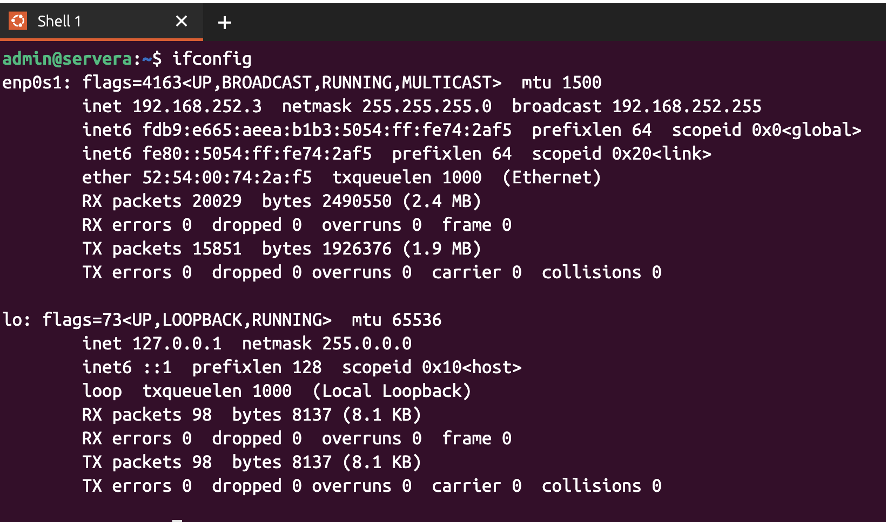
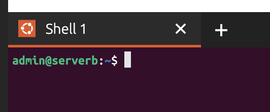
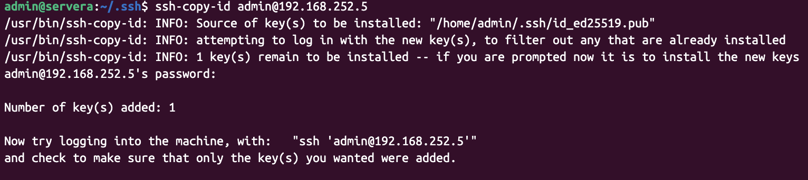
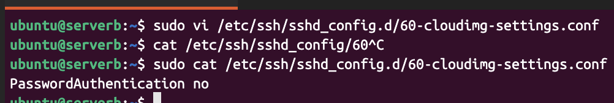
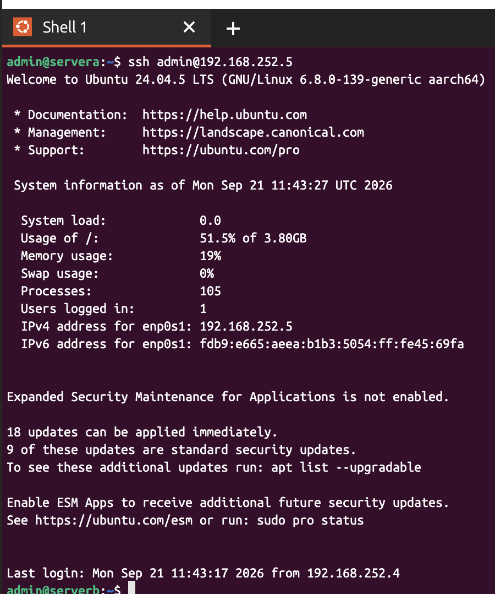
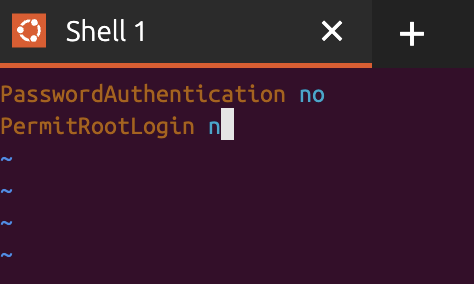
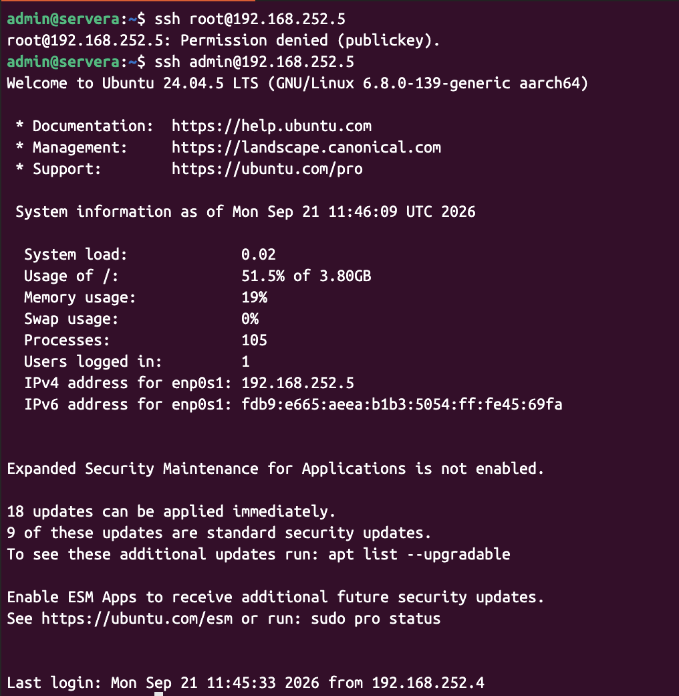

# Week 03 - Lab 02

## 실습 정보

- 발표자: 김보겸
- 주제: 
    - Flatpak 리포지토리 구성 및 패키지 관리
    - SSH 서비스 설정 및 키 기반(Key-based) SSH 인증 구성
- 유형: 실습형

---

## 문제

# Week 03 - Lab

## Flatpak 리포지토리 구성 및 SSH 키 기반 인증

### 1. `servera` 시스템에 `admin` 사용자로 로그인합니다. (`admin@servera`)

### 2. `servera` 시스템에서 `serverb` 시스템에 `admin` 사용자로 SSH 로그인합니다. (`admin@serverb`)

두 번째 터미널을 열어 `servera` 시스템에서 `admin` 사용자에 대한 SSH 키 페어를 생성합니다.

> 암호(passphrase)는 설정하지 마십시오.

### 3. `admin` 사용자의 SSH 공개키를 `serverb` 시스템의 `admin` 사용자에게 전송합니다.

`serverb` 시스템에서 공개키가 정상적으로 등록되었는지 확인합니다.

### 4. 첫 번째 터미널로 전환해 `serverb` 시스템에서 암호로 인증할 수 없도록 `sshd` 서비스를 구성합니다.

### 5. 두 번째 터미널로 전환해 `servera` 시스템에서 SSH 키를 사용하여 `serverb` 시스템에 성공적으로 로그인할 수 있는지 확인합니다. (`admin@serverb`)

### 6. 첫 번째 터미널로 전환해 `serverb` 시스템에 `root` 사용자로 로그인하지 못하도록 `sshd` 서비스를 구성합니다.

### 7. 두 번째 터미널로 전환해 `servera` 시스템에서 `serverb` 시스템의 `root` 사용자로 로그인할 수 없는지 확인합니다. (`root@serverb`)

### 수행 결과

문제에서 요구한 최종 상태가 정상적으로 적용되었는지 작성합니다.

이미지가 필요한 경우 `images/` 폴더에 저장한 뒤 첨부합니다.   
문제 1  
  
문제 2  
  
문제 3  
  
문제 4  
  
문제 5  
  
문제 6  
  
문제 7  
  

---