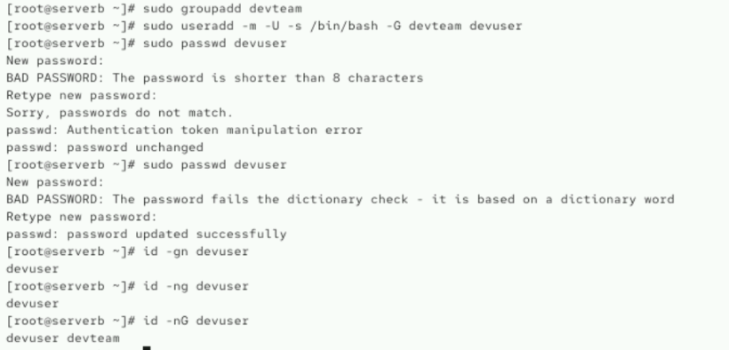
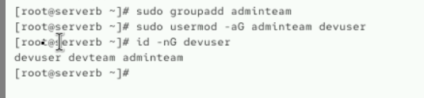
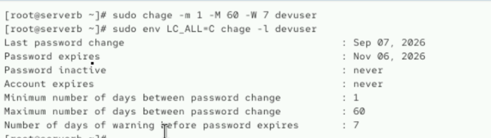
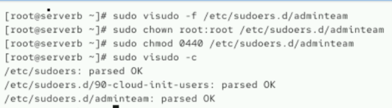
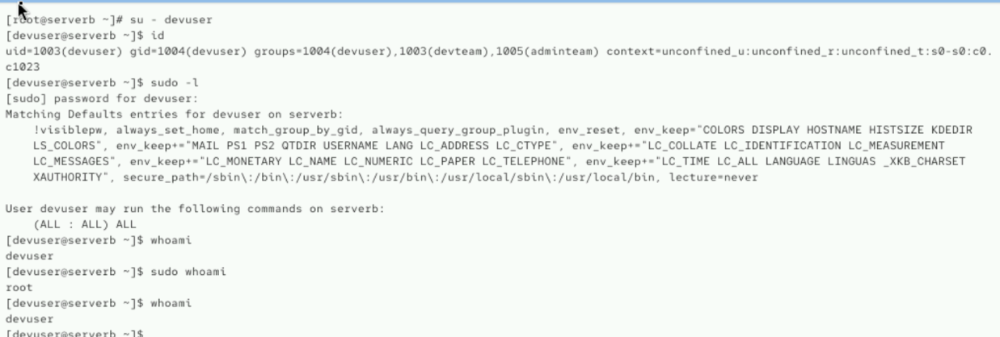

# Week 02 - Lab 02

## 실습 정보

- 발표자: 김기석
- 주제: 사용자/그룹 관리 및 Sudo 권한
- 유형: 실습형

---

## 문제 1

`devteam` 그룹을 생성하세요.

### 수행 결과

`devteam` 그룹을 생성했습니다.



---

## 문제 2

`devuser` 사용자를 생성하세요.

- 홈 디렉터리가 있어야 합니다.
- 로그인 셸은 `/bin/bash`로 설정합니다.
- `devteam`을 보조 그룹으로 설정합니다.

### 수행 결과

`devuser`를 생성하고 비밀번호를 설정한 뒤, 기본 그룹과 보조 그룹을 확인했습니다.

```text
기본 그룹: devuser
보조 그룹: devteam
```


---

## 문제 3

`adminteam` 그룹을 만들고, `devuser`가 기존 `devteam` 소속을 유지한 채 `adminteam`에도 속하도록 설정하세요.

### 수행 결과

기존 `devteam` 소속을 유지하면서 `adminteam`을 추가했습니다.

```text
devuser devteam adminteam
```





---

## 문제 4

`devuser`의 비밀번호 정책을 다음과 같이 설정하세요.

- 최소 사용 기간: 1일
- 최대 사용 기간: 60일
- 만료 전 경고: 7일

### 수행 결과

비밀번호 정책을 설정한 뒤 `chage -l`로 확인했습니다.

```text
Minimum number of days between password change : 1
Maximum number of days between password change : 60
Number of days of warning before password expires : 7
```





---

## 문제 5

`adminteam` 그룹 사용자가 `sudo`를 통해 관리자 명령을 실행할 수 있도록 `/etc/sudoers.d/`에 별도 규칙을 구성하세요.

### 수행 결과

`/etc/sudoers.d/adminteam` 파일을 생성하고 sudo 권한을 설정했습니다.

```text
%adminteam ALL=(ALL:ALL) ALL
```

파일의 소유권과 권한을 설정하고 `visudo -c`로 문법을 검증했습니다.

```text
/etc/sudoers.d/adminteam: parsed OK
```





---

## 문제 6

`devuser`로 새 로그인한 뒤, 그룹 소속과 sudo 권한이 실제로 적용되었는지 검증하세요.

### 수행 결과

`devuser`로 로그인한 뒤 그룹 및 sudo 권한을 확인했습니다.

```text
devuser → root → devuser
```

`sudo whoami` 실행 시에만 `root` 권한으로 실행되고, 이후 원래 사용자인 `devuser`로 돌아오는 것을 확인했습니다.





---

# 선택 작성

아래 항목은 필요한 경우에만 작성합니다.

## Troubleshooting

### 문제

비밀번호 설정 과정에서 비밀번호 길이 경고와 재입력 불일치가 발생했습니다.

```text
BAD PASSWORD: The password is shorter than 8 characters
Sorry, passwords do not match.
passwd: password unchanged
```

### 원인

처음 입력한 비밀번호가 짧았으며, 첫 번째 입력값과 재입력한 비밀번호가 일치하지 않았습니다.

### 해결

비밀번호를 다시 입력하여 정상적으로 설정했습니다.

```text
passwd: password updated successfully
```

---

## 배운 점

- `useradd -G`를 사용하여 사용자를 보조 그룹에 포함할 수 있습니다.
- 기존 보조 그룹을 유지하면서 새로운 그룹을 추가할 때는 `usermod -aG`를 사용해야 합니다.
- `chage`를 사용해 비밀번호 최소/최대 사용 기간과 만료 전 경고 기간을 설정할 수 있습니다.
- `/etc/sudoers.d/`에 그룹 단위의 sudo 규칙을 별도로 관리할 수 있습니다.
- `visudo -c`를 통해 sudoers 설정의 문법을 검증할 수 있습니다.
- `sudo`는 해당 명령만 관리자 권한으로 실행하며 기존 로그인 사용자가 root로 영구 변경되는 것은 아닙니다.