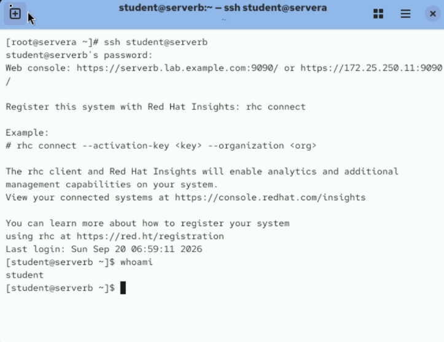
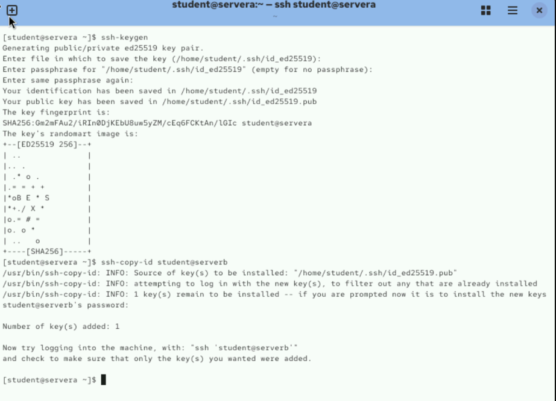
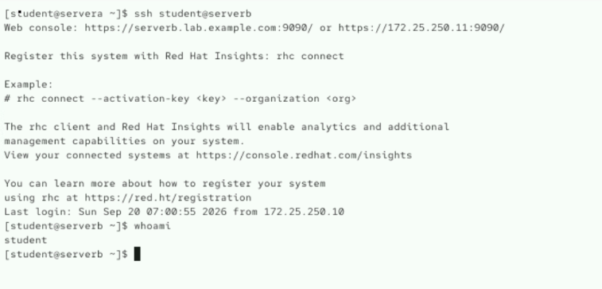
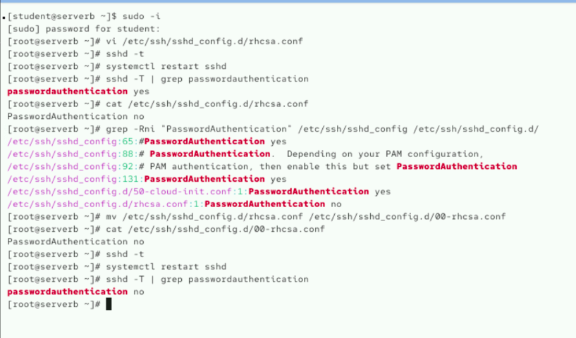
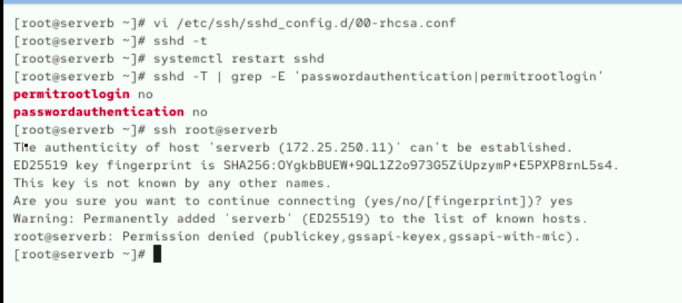
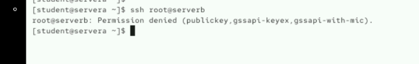

# Week 03 - Lab 02

## 실습 정보

- 발표자: 김보겸
- 주제: SSH 서비스 설정 및 키 기반 SSH 인증 구성
- 유형: 실습형

---

## 문제 1

> `servera` 시스템에서 `serverb` 시스템에 SSH로 로그인합니다.

### 수행 결과

`servera`에서 `student` 사용자로 `serverb`에 SSH 접속한 뒤, `whoami` 명령으로 현재 사용자가 `student`인지 확인했습니다.

```bash
ssh student@serverb
whoami
```



---

## 문제 2

> `servera` 시스템에서 SSH 키 페어를 생성하고, 공개 키를 `serverb` 시스템의 사용자에게 전송합니다.  
> 키 생성 시 passphrase는 설정하지 않습니다.

### 수행 결과

`servera`의 `student` 사용자에서 `ssh-keygen` 명령으로 ED25519 키 페어를 생성했습니다.

이후 `ssh-copy-id` 명령을 사용하여 공개 키를 `serverb`의 `student` 사용자에게 전송했습니다.

```bash
ssh-keygen
ssh-copy-id student@serverb
```

실행 결과 공개 키 1개가 정상적으로 등록된 것을 확인했습니다.

```text
Number of key(s) added: 1
```



---

## 문제 3

> `servera` 시스템에서 SSH 키를 사용하여 `serverb` 시스템에 정상적으로 로그인할 수 있는지 확인합니다.

### 수행 결과

공개 키 등록 후 `servera`에서 `serverb`로 다시 SSH 접속했습니다.

```bash
ssh student@serverb
whoami
```

별도의 계정 비밀번호 입력 없이 로그인되었으며, `whoami` 결과가 `student`로 출력되어 SSH 키 기반 인증이 정상적으로 동작하는 것을 확인했습니다.



---

## 문제 4

> `serverb` 시스템에서 SSH 접속 시 비밀번호로 인증할 수 없도록 `sshd` 서비스를 구성합니다.

### 수행 결과

`serverb`에서 SSH 비밀번호 인증을 비활성화하기 위해 다음 설정을 적용했습니다.

```text
PasswordAuthentication no
```

설정 문법을 확인하고 `sshd` 서비스를 재시작한 뒤, 실제 적용된 설정값을 확인했습니다.

```bash
sshd -t
systemctl restart sshd
sshd -T | grep passwordauthentication
```

최종적으로 다음과 같이 적용된 것을 확인했습니다.

```text
passwordauthentication no
```



---

## 문제 5

> `serverb` 시스템에 `root` 사용자로 SSH 로그인하지 못하도록 `sshd` 서비스를 구성합니다.

### 수행 결과

SSH 설정 파일에 다음 항목을 추가했습니다.

```text
PermitRootLogin no
```

설정을 적용한 후 실제 설정값을 확인했습니다.

```bash
sshd -t
systemctl restart sshd
sshd -T | grep -E 'passwordauthentication|permitrootlogin'
```

다음과 같이 비밀번호 인증과 root 직접 로그인이 모두 비활성화된 것을 확인했습니다.

```text
permitrootlogin no
passwordauthentication no
```

또한 `root` 사용자로 SSH 로그인을 시도했을 때 로그인이 거부되는 것을 확인했습니다.



---

## 문제 6

> `servera` 시스템에서 `serverb` 시스템의 `root` 사용자로 SSH 로그인할 수 없는지 확인합니다.

### 수행 결과

`servera`에서 `serverb`의 `root` 사용자로 SSH 로그인을 시도했습니다.

```bash
ssh root@serverb
```

다음과 같이 `Permission denied` 메시지가 출력되어 root 사용자의 직접 SSH 로그인이 차단된 것을 확인했습니다.

```text
Permission denied (publickey,gssapi-keyex,gssapi-with-mic).
```



---

# 선택 작성

아래 항목은 필요한 경우에만 작성합니다.

## Troubleshooting

### 문제

> `PasswordAuthentication no`를 설정했지만 실제 적용된 설정을 확인했을 때 `passwordauthentication yes`가 출력되었습니다.

### 원인

`/etc/ssh/sshd_config.d/` 디렉터리의 설정 파일을 확인한 결과, `50-cloud-init.conf` 파일에 다음 설정이 존재했습니다.

```text
PasswordAuthentication yes
```

기존 설정 파일의 적용 순서 때문에 새로 작성한 `rhcsa.conf`의 설정이 원하는 대로 적용되지 않았습니다.

### 해결

작성한 설정 파일의 이름을 `00-rhcsa.conf`로 변경하여 기존 `50-cloud-init.conf`보다 먼저 적용되도록 했습니다.

```bash
mv /etc/ssh/sshd_config.d/rhcsa.conf /etc/ssh/sshd_config.d/00-rhcsa.conf

sshd -t
systemctl restart sshd
sshd -T | grep passwordauthentication
```

최종적으로 다음과 같이 설정된 것을 확인했습니다.

```text
passwordauthentication no
```

---

## 배운 점

- `ssh-keygen`을 사용하여 SSH 키 페어를 생성할 수 있습니다.
- `ssh-copy-id`를 사용하면 공개 키를 원격 서버의 사용자에게 등록할 수 있습니다.
- SSH 공개 키 인증을 설정하면 계정 비밀번호 없이 원격 서버에 로그인할 수 있습니다.
- `PasswordAuthentication no`를 사용하면 SSH 비밀번호 인증을 비활성화할 수 있습니다.
- `PermitRootLogin no`를 사용하면 root 사용자의 직접 SSH 로그인을 차단할 수 있습니다.
- `/etc/ssh/sshd_config.d/`에 여러 설정 파일이 있는 경우 파일의 적용 순서도 확인해야 합니다.
- `sshd -T` 명령으로 실제 적용된 SSH 설정값을 확인할 수 있습니다.