# 20260928

- GPT 파티션 생성/삭제 (fdisk, gdisk)  
- LVM (PV, VG, LV) 생성/제거 및 데이터 손실 없는 LV 확장 (lvextend -r) 

---

### 개요

리눅스에서 디스크가 어떻게 동작하는지 알아본다.

그전에 **디바이스를** 알아야 한다. 스토리지는 OS관점에선 장치이기 때문에 리눅스에서 정의한 장치 규격에 맞게 사용되야 한다. Linux에서 장치는 크게 4가지가 있다.

**Block Device**, Character Device, Pipe Device, Socket Device가 있는데 프로그램은 이 디바이스 중 block device에서 chunk단위로 파일을 읽고 쓴다. 블록 디바이스는 다른 디바이스들과 다르게 **사이즈가 고정되어** 있어 인덱스 하기 쉽고 **random access**가 가능하기 때문이다.

Block Device는 Linux상의 논리적 개념이기 때문에 실제 저장 장치를 알아보자. 이동식 미디어란 무엇일까?

> 시스템에 쉽게 삽입하고 제거할 수 있도록 설계된 데이터 저장 매체이다.
USB, HDD, SSD, SD카드 등
> 

당연히 저장 매체마다 드라이버가 다른데 이에 따라 표시되는 디바이스 명이 달라지게 된다.

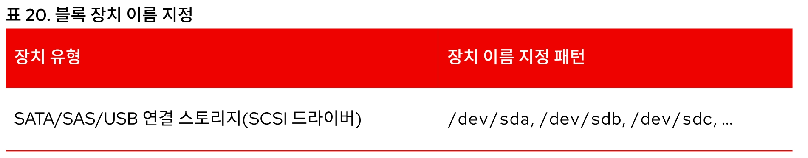

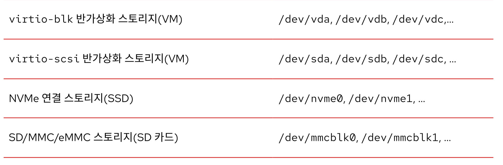

블록 디바이스 파티션 명명 규칙

sda(sda1, sda2 …)  → sdb → sdc

참고) SSD 파티션 명명 규칙

nvme0(nvme0n1p1, nvme0n1p2) → nvme1

n : 네임스페이스, p : 파티션

참고로 ssd는 컨트롤러 + 디스크 구조인데 하나의 컨트롤러에 여러개의 디스크가 부착되면 네임스페이스가 늘어난다.

nvme0n1 → nvme0n2…

https://docs.aws.amazon.com/ko_kr/ebs/latest/userguide/identify-nvme-ebs-device.html

일반적으로는 1 디스크 1 네임스페이스..!

#### 파티셔닝의 목적

그렇다면 이동식 미디어를 그대로 블록 디바이스로 사용하면 되는 것 아닌가?

당연히 가능하나 파티셔닝을 해서 얻게되는 이점이 더 많으므로 단일 목적으로 사용되는 것이 아니라면 목적별로 분리를 하는 것이 권장된다.

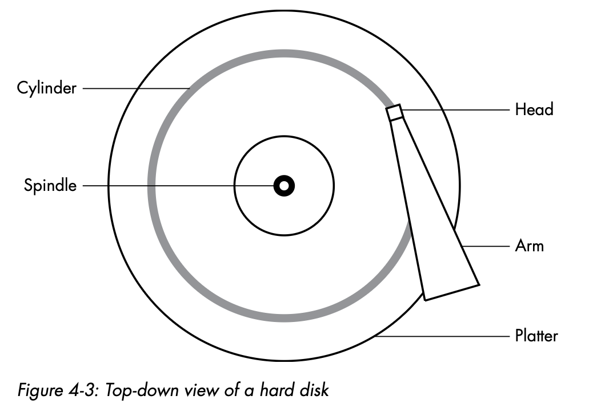

이점 1 : **접근 속도 향상**

- 디스크를 기준으로 설명하면, 파티션은 섹터가 나눠져있고 이는 access할 위치가 정해져 있다는 뜻으로 파일 접근 속도가 향상될 수 있다.

이점 2 : **관리 효율성**

- 백업, 포맷을 진행할 때 파티셔닝이 이루어져있지 않다면 복제 단위는 디스크 사이즈만큼이 된다. 파티셔닝이 됐다는 것은 필요한 범위만큼 백업, 포맷이 가능하다는 의미이다.

#### 파티션 테이블

파티셔닝에도 종류가 있다. MBR, GPT가 있는데 MBR 파티셔닝의 단점을 개선한 GPT 파티셔닝이 범용적으로 사용된다. **파티션 테이블은 스토리지의 파티션 현황을 보여주는 테이블**로 파티션 방식에 따라 파티셔닝 테이블 내용도 다르다. 아래 그림에서 파티션 테이블의 위치를 확인하자.
(어딘가엔 파티션 테이블이 포함되야 하는데 그 위치가 어디일지)

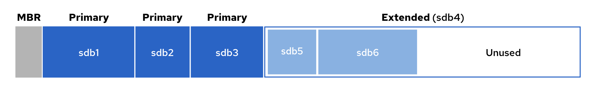

MBR은 파티션 테이블이 앞에 하나 있다.

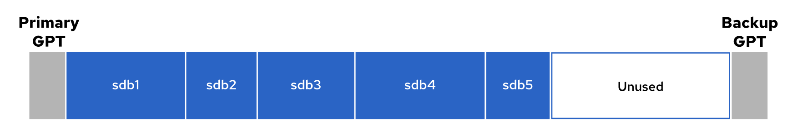

GPT는 앞뒤로 파티션 테이블이 존재(양쪽에 테이블 정보를 저장해 복구력을 높였다)

#### 파일 시스템의 목적

그렇다면 전체 혹은 파티셔닝된 블록 디바이스를 그대로 사용하면 되는 것 아닌가?

당연히 가능하나 방식에 차이가 있다.

기본적으로 저장 매체들은 0,1의 정보만 가지고 있다. **즉 디렉토리와 같은 계층 구조를 만들 수 없다는** 의미이다. 파일 시스템은 파일에 대한 메타 데이터 등을 관리하며 파티션의 데이터 베이스와 같은 역할을 한다.

파일 시스템을 OS가 아닌 어플리케이션에 위임할 수 있다. 이 방식을 **Raw Device**방식이라고 부르고 디바이스에 /dev/rdsk와 같이 r이 앞에 표기된다. 오라클 RAC에서 위 방식을 사용하고 파일 관리의 주체가 어플리케이션이기 때문에 **OS 오버헤드를 낮춰 성능을 높일 수 있다.** 성능이 높아지는 만큼 관리하기 어렵기 때문에 극도로 성능이 중요한 상황이 아니면 파일 시스템을 구성하는 것이 일반적이다.

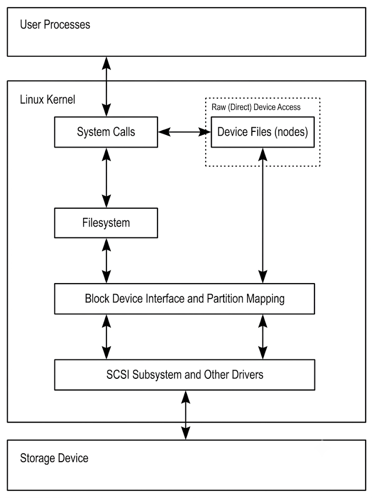

파일 접근 일련의 과정

실습을 위해 파일 시스템을 훑어 보자.

ext4 - 싱글 스레드 및 작은 파일들이 많은 환경에 유리

xfs - 멀티 스레드 및 병렬 I/O, 대용량 파일 환경에 유리 ← 마운트에 해당 파일 시스템 타입을 사용할 예정

---

### 파티션 테이블 확인(단위를 주의할 것)

섹터 : 하드 디스크의 물리적인 최소 단위

블록 : 파일 시스템에서 파일을 읽는 단위

```bash
root@jwpark-rocky:~# parted -l
Model: Msft Virtual Disk (scsi)
Disk /dev/sda: 32.2GB <- GB
Sector size (logical/physical): 512B/4096B
Partition Table: gpt
Disk Flags:

Number  Start   End     Size    File system  Name  Flags
14      1049kB  5243kB  4194kB                     bios_grub
15      5243kB  116MB   111MB   fat32              boot, esp
16      116MB   1074MB  957MB   ext4               bls_boot
 1      1075MB  32.2GB  31.1GB  ext4

Model: Msft Virtual Disk (scsi)
Disk /dev/sdb: 4295MB
Sector size (logical/physical): 512B/4096B
Partition Table: msdos
Disk Flags:

Number  Start   End     Size    Type     File system  Flags
 1      1049kB  4294MB  4293MB  primary  ext4

root@jwpark-rocky:~# fdisk -l
Disk /dev/sdb: 4 GiB, 4294967296 bytes, 8388608 sectors
Disk model: Virtual Disk
Units: sectors of 1 * 512 = 512 bytes
Sector size (logical/physical): 512 bytes / 4096 bytes
I/O size (minimum/optimal): 4096 bytes / 4096 bytes
Disklabel type: dos
Disk identifier: 0x493619d8

Device     Boot Start     End Sectors Size Id Type
/dev/sdb1        2048 8386559 8384512   4G  7 HPFS/NTFS/exFAT

Disk /dev/sda: 30 GiB, 32213303296 bytes, 62916608 sectors <- GiB
Disk model: Virtual Disk
Units: sectors of 1 * 512 = 512 bytes
Sector size (logical/physical): 512 bytes / 4096 bytes
I/O size (minimum/optimal): 4096 bytes / 4096 bytes
Disklabel type: gpt
Disk identifier: 39971A9E-5755-4EFE-89BC-E1685BCF7502

Device       Start      End  Sectors  Size Type
/dev/sda1  2099200 62916574 60817375   29G Linux filesystem
/dev/sda14    2048    10239     8192    4M BIOS boot
/dev/sda15   10240   227327   217088  106M EFI System
/dev/sda16  227328  2097152  1869825  913M Linux extended boot

Partition table entries are not in disk order.

root@jwpark-rocky:~# df -h
Filesystem      Size  Used Avail Use% Mounted on
/dev/root        29G  1.7G   27G   6% /
tmpfs           950M     0  950M   0% /dev/shm
tmpfs           380M  972K  379M   1% /run
tmpfs           5.0M     0  5.0M   0% /run/lock
efivarfs        128M   32K  128M   1% /sys/firmware/efi/efivars
/dev/sda16      881M   64M  756M   8% /boot
/dev/sda15      105M  6.2M   99M   6% /boot/efi
/dev/sdb1       3.9G   28K  3.7G   1% /mnt
tmpfs           190M   12K  190M   1% /run/user/1000
```

### 파티셔닝 생성 - fdisk

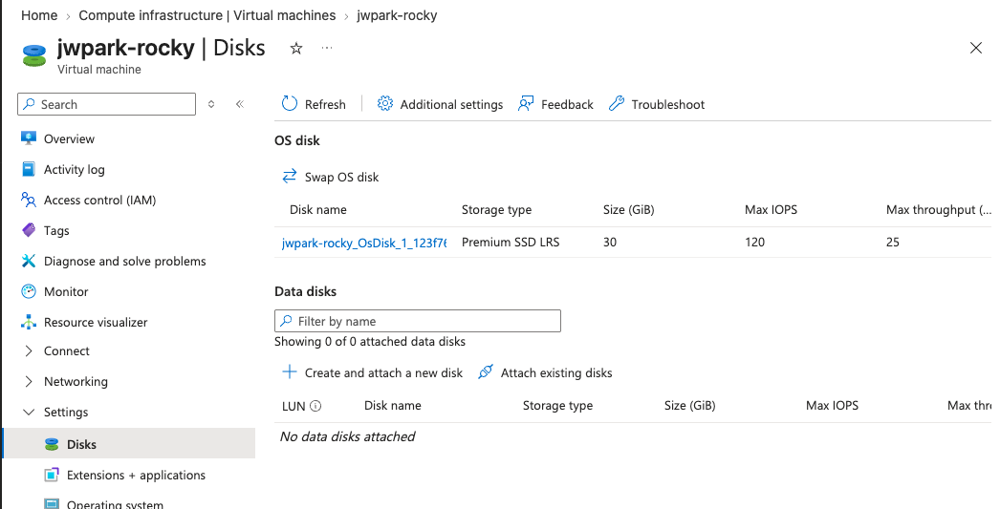

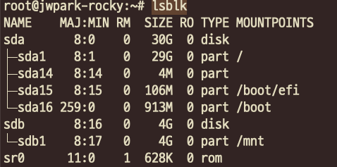

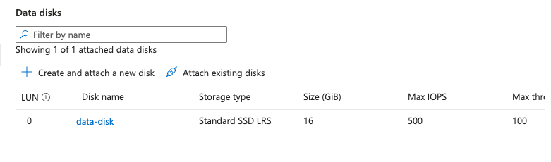

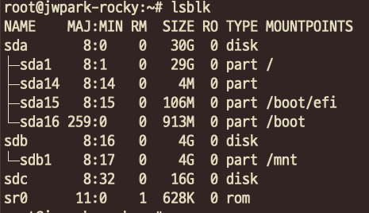

디스크를 연결하면 sdc 블록 디바이스를 확인할 수 있다.

```bash
root@jwpark-rocky:~# fdisk /dev/sdc

Welcome to fdisk (util-linux 2.39.3).
Changes will remain in memory only, until you decide to write them.
Be careful before using the write command.

Device does not contain a recognized partition table.
Created a new DOS (MBR) disklabel with disk identifier 0x184527d3.

Command (m for help): m

Help:

  DOS (MBR)
   a   toggle a bootable flag
   b   edit nested BSD disklabel
   c   toggle the dos compatibility flag

  Generic
   d   delete a partition
   F   list free unpartitioned space
   l   list known partition types
   n   add a new partition
   p   print the partition table
   t   change a partition type
   v   verify the partition table
   i   print information about a partition

  Misc
   m   print this menu
   u   change display/entry units
   x   extra functionality (experts only)

  Script
   I   load disk layout from sfdisk script file
   O   dump disk layout to sfdisk script file

  Save & Exit
   w   write table to disk and exit
   q   quit without saving changes

  Create a new label
   g   create a new empty GPT partition table
   G   create a new empty SGI (IRIX) partition table
   o   create a new empty MBR (DOS) partition table
   s   create a new empty Sun partition table
```

```bash
Command (m for help): g
Created a new GPT disklabel (GUID: 4D89B147-F8F2-411C-A291-90EA5F9F92F0).

Command (m for help): l
  1 EFI System                     C12A7328-F81F-11D2-BA4B-00A0C93EC93B
  2 MBR partition scheme           024DEE41-33E7-11D3-9D69-0008C781F39F
  3 Intel Fast Flash               D3BFE2DE-3DAF-11DF-BA40-E3A556D89593
  4 BIOS boot                      21686148-6449-6E6F-744E-656564454649
  5 Sony boot partition            F4019732-066E-4E12-8273-346C5641494F
  6 Lenovo boot partition          BFBFAFE7-A34F-448A-9A5B-6213EB736C22
  7 PowerPC PReP boot              9E1A2D38-C612-4316-AA26-8B49521E5A8B
  8 ONIE boot                      7412F7D5-A156-4B13-81DC-867174929325
  9 ONIE config                    D4E6E2CD-4469-46F3-B5CB-1BFF57AFC149
 ...
```

```bash
Command (m for help): n
Partition number (1-128, default 1): 1
First sector (2048-33554398, default 2048): 2048
Last sector, +/-sectors or +/-size{K,M,G,T,P} (2048-33554398, default 33552383): +10G

Created a new partition 1 of type 'Linux filesystem' and of size 10 GiB.

Command (m for help): p
Disk /dev/sdc: 16 GiB, 17179869184 bytes, 33554432 sectors
Disk model: Virtual Disk
Units: sectors of 1 * 512 = 512 bytes
Sector size (logical/physical): 512 bytes / 4096 bytes
I/O size (minimum/optimal): 4096 bytes / 4096 bytes
Disklabel type: gpt
Disk identifier: 4D89B147-F8F2-411C-A291-90EA5F9F92F0

Device     Start      End  Sectors Size Type
/dev/sdc1   2048 20973567 20971520  10G Linux filesystem

Command (m for help): n
Partition number (2-128, default 2): 2
First sector (20973568-33554398, default 20973568):
Last sector, +/-sectors or +/-size{K,M,G,T,P} (20973568-33554398, default 33552383): +6G
Value out of range.
Last sector, +/-sectors or +/-size{K,M,G,T,P} (20973568-33554398, default 33552383): +5G

Created a new partition 2 of type 'Linux filesystem' and of size 5 GiB.

Command (m for help): p
Disk /dev/sdc: 16 GiB, 17179869184 bytes, 33554432 sectors
Disk model: Virtual Disk
Units: sectors of 1 * 512 = 512 bytes
Sector size (logical/physical): 512 bytes / 4096 bytes
I/O size (minimum/optimal): 4096 bytes / 4096 bytes
Disklabel type: gpt
Disk identifier: 4D89B147-F8F2-411C-A291-90EA5F9F92F0

Device        Start      End  Sectors Size Type
/dev/sdc1      2048 20973567 20971520  10G Linux filesystem
/dev/sdc2  20973568 31459327 10485760   5G Linux filesystem

Command (m for help): w
The partition table has been altered.
Calling ioctl() to re-read partition table.
Syncing disks.
```

```bash
root@jwpark-rocky:~# fdisk /dev/sdc print
fdisk: bad usage
Try 'fdisk --help' for more information.
root@jwpark-rocky:~# fdisk /dev/sdc

Welcome to fdisk (util-linux 2.39.3).
Changes will remain in memory only, until you decide to write them.
Be careful before using the write command.

Command (m for help): print
Disk /dev/sdc: 16 GiB, 17179869184 bytes, 33554432 sectors
Disk model: Virtual Disk
Units: sectors of 1 * 512 = 512 bytes
Sector size (logical/physical): 512 bytes / 4096 bytes
I/O size (minimum/optimal): 4096 bytes / 4096 bytes
Disklabel type: gpt
Disk identifier: 4D89B147-F8F2-411C-A291-90EA5F9F92F0

Device        Start      End  Sectors Size Type
/dev/sdc1      2048 20973567 20971520  10G Linux filesystem
/dev/sdc2  20973568 31459327 10485760   5G Linux filesystem

Command (m for help):
```

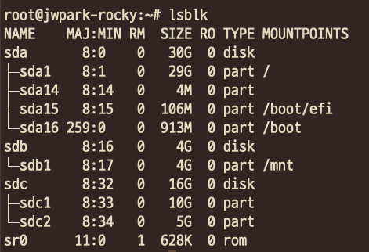

### 파티셔닝 생성 - gdisk

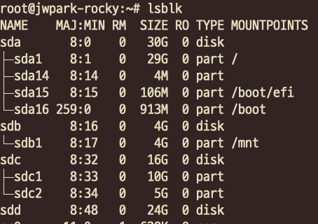

디스크를 추가 attach(sdd)

```bash
root@jwpark-rocky:~# gdisk /dev/sdd
GPT fdisk (gdisk) version 1.0.10

Partition table scan:
  MBR: not present
  BSD: not present
  APM: not present
  GPT: not present

Creating new GPT entries in memory.

Command (? for help): ?
b	back up GPT data to a file
c	change a partition's name
d	delete a partition
i	show detailed information on a partition
l	list known partition types
n	add a new partition
o	create a new empty GUID partition table (GPT)
p	print the partition table
q	quit without saving changes
r	recovery and transformation options (experts only)
s	sort partitions
t	change a partition's type code
v	verify disk
w	write table to disk and exit
x	extra functionality (experts only)
?	print this menu

Command (? for help): n
Partition number (1-128, default 1): 2
First sector (34-50331614, default = 2048) or {+-}size{KMGTP}:
Last sector (2048-50331614, default = 50329599) or {+-}size{KMGTP}: +10G
Current type is 8300 (Linux filesystem)
Hex code or GUID (L to show codes, Enter = 8300): L
Type search string, or <Enter> to show all codes:
0700 Microsoft basic data                0701 Microsoft Storage Replica
0702 ArcaOS Type 1                       0c01 Microsoft reserved
2700 Windows RE                          3000 ONIE boot
3001 ONIE config                         3900 Plan 9
4100 PowerPC PReP boot                   4200 Windows LDM data
4201 Windows LDM metadata                4202 Windows Storage Spaces
7501 IBM GPFS                            7f00 ChromeOS kernel
7f01 ChromeOS root                       7f02 ChromeOS reserved
7f03 ChromeOS firmware                   7f04 ChromeOS mini-OS
7f05 ChromeOS hibernate                  8200 Linux swap
8300 Linux filesystem                    8301 Linux reserved
...
Press the <Enter> key to see more codes, q to quit: q

Hex code or GUID (L to show codes, Enter = 8300): 8e00
Changed type of partition to 'Linux LVM'

Command (? for help): p
Disk /dev/sdd: 50331648 sectors, 24.0 GiB
Model: Virtual Disk
Sector size (logical/physical): 512/4096 bytes
Disk identifier (GUID): B970F600-D951-4740-820D-65B83D39CB9D
Partition table holds up to 128 entries
Main partition table begins at sector 2 and ends at sector 33
First usable sector is 34, last usable sector is 50331614
Partitions will be aligned on 2048-sector boundaries
Total free space is 29360061 sectors (14.0 GiB)

Number  Start (sector)    End (sector)  Size       Code  Name
   2            2048        20973567   10.0 GiB    8E00  Linux LVM

Command (? for help): w

Final checks complete. About to write GPT data. THIS WILL OVERWRITE EXISTING
PARTITIONS!!

Do you want to proceed? (Y/N): Y
OK; writing new GUID partition table (GPT) to /dev/sdd.
The operation has completed successfully.
```

```bash
root@jwpark-rocky:~# lsblk
NAME    MAJ:MIN RM  SIZE RO TYPE MOUNTPOINTS
sda       8:0    0   30G  0 disk
├─sda1    8:1    0   29G  0 part /
├─sda14   8:14   0    4M  0 part
├─sda15   8:15   0  106M  0 part /boot/efi
└─sda16 259:0    0  913M  0 part /boot
sdb       8:16   0    4G  0 disk
└─sdb1    8:17   0    4G  0 part /mnt
sdc       8:32   0   16G  0 disk
├─sdc1    8:33   0   10G  0 part
└─sdc2    8:34   0    5G  0 part
sdd       8:48   0   24G  0 disk
└─sdd2    8:50   0   10G  0 part
sr0      11:0    1  628K  0 rom
```

남은 용량만큼은 sdd1, **8300 Linux filesystem** 타입으로 만듦

```bash
root@jwpark-rocky:~# lsblk
NAME    MAJ:MIN RM  SIZE RO TYPE MOUNTPOINTS
sda       8:0    0   30G  0 disk
├─sda1    8:1    0   29G  0 part /
├─sda14   8:14   0    4M  0 part
├─sda15   8:15   0  106M  0 part /boot/efi
└─sda16 259:0    0  913M  0 part /boot
sdb       8:16   0    4G  0 disk
└─sdb1    8:17   0    4G  0 part /mnt
sdc       8:32   0   16G  0 disk
├─sdc1    8:33   0   10G  0 part
└─sdc2    8:34   0    5G  0 part
sdd       8:48   0   24G  0 disk
├─sdd1    8:49   0   14G  0 part
└─sdd2    8:50   0   10G  0 part
sr0      11:0    1  628K  0 rom
```

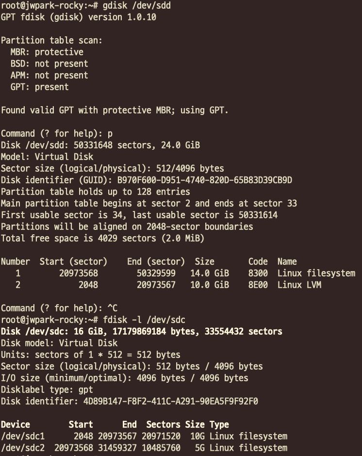

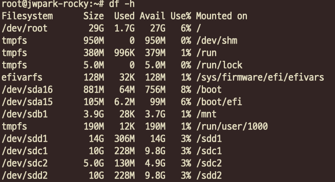

guid는 라벨역할이기 때문에 차후 systemd, 부트로더등에서 관리 대상으로 포함되는 것이지 파일 시스템으로 만들 때 특별한 제약이 있는 것은 아니다.

### LVM의 목적


### pgcreate

```bash
root@jwpark-vm:~# lsblk
NAME    MAJ:MIN RM  SIZE RO TYPE MOUNTPOINTS
sda       8:0    0   16G  0 disk
├─sda1    8:1    0  7.4G  0 part
├─sda2    8:2    0  3.7G  0 part
└─sda3    8:3    0  4.8G  0 part
sdb       8:16   0   16G  0 disk
├─sdb1    8:17   0  7.4G  0 part
├─sdb2    8:18   0  3.7G  0 part
└─sdb3    8:19   0  4.8G  0 part
sdc       8:32   0   30G  0 disk
├─sdc1    8:33   0   29G  0 part /
├─sdc14   8:46   0    4M  0 part
├─sdc15   8:47   0  106M  0 part /boot/efi
└─sdc16 259:0    0  913M  0 part /boot
sdd       8:48   0    4G  0 disk
└─sdd1    8:49   0    4G  0 part /mnt
sr0      11:0    1  628K  0 rom
root@jwpark-vm:~# pvcreate /dev/sdb1 /dev/sdb2 /dev/sdb3
  Physical volume "/dev/sdb1" successfully created.
  Physical volume "/dev/sdb2" successfully created.
  Physical volume "/dev/sdb3" successfully created.
root@jwpark-vm:~# pvdisplay
  "/dev/sda1" is a new physical volume of "<7.45 GiB"
  --- NEW Physical volume ---
  PV Name               /dev/sda1
  VG Name
  PV Size               <7.45 GiB
  Allocatable           NO
  PE Size               0
  Total PE              0
  Free PE               0
  Allocated PE          0
  PV UUID               yyiMhc-Urd5-2YRo-ahfP-G92I-2ROa-tkCxOA

  "/dev/sda2" is a new physical volume of "<3.73 GiB"
  --- NEW Physical volume ---
  PV Name               /dev/sda2
  VG Name
  PV Size               <3.73 GiB
  Allocatable           NO
  PE Size               0
  Total PE              0
  Free PE               0
  Allocated PE          0
  PV UUID               BzLzFW-SWJE-bGSd-8LQF-Wq81-ckob-Tx8PUO

  "/dev/sda3" is a new physical volume of "4.82 GiB"
  --- NEW Physical volume ---
  PV Name               /dev/sda3
  VG Name
  PV Size               4.82 GiB
  Allocatable           NO
  PE Size               0
  Total PE              0
  Free PE               0
  Allocated PE          0
  PV UUID               F2CScv-a3yt-BPh2-kXNj-V3mY-4pV9-vOzhT8

  "/dev/sdb1" is a new physical volume of "<7.45 GiB"
  --- NEW Physical volume ---
  PV Name               /dev/sdb1
  VG Name
  PV Size               <7.45 GiB
  Allocatable           NO
  PE Size               0
  Total PE              0
  Free PE               0
  Allocated PE          0
  PV UUID               kv4fpk-yeao-oks8-vJht-A6fy-BVUk-4U5bxL

  "/dev/sdb2" is a new physical volume of "<3.73 GiB"
  --- NEW Physical volume ---
  PV Name               /dev/sdb2
  VG Name
  PV Size               <3.73 GiB
  Allocatable           NO
  PE Size               0
  Total PE              0
  Free PE               0
  Allocated PE          0
  PV UUID               q84QQK-d4XQ-Eo1z-Qw5c-OogL-lfFy-xZu0mM

  "/dev/sdb3" is a new physical volume of "4.82 GiB"
  --- NEW Physical volume ---
  PV Name               /dev/sdb3
  VG Name
  PV Size               4.82 GiB
  Allocatable           NO
  PE Size               0
  Total PE              0
  Free PE               0
  Allocated PE          0
  PV UUID               XcwhZG-E7tA-N3mr-hTKz-14yx-3uZz-f7RKzc
```

### vgcreate

```bash
sda       8:0    0   16G  0 disk
├─sda1    8:1    0  7.4G  0 part
├─sda2    8:2    0  3.7G  0 part
└─sda3    8:3    0  4.8G  0 part
sdb       8:16   0   16G  0 disk
├─sdb1    8:17   0  7.4G  0 part
├─sdb2    8:18   0  3.7G  0 part
└─sdb3    8:19   0  4.8G  0 part

1 + 1으로 14
2 + 2 + 3 + 3으로 10을 만들고 5 확장할 예정
```

```bash
root@jwpark-vm:~# vgcreate vg00 /dev/sda1 /dev/sdb1
  Volume group "vg00" successfully created
root@jwpark-vm:~# vgcreate vg01 /dev/sda2 /dev/sda3 /dev/sdb2 /dev/sdb3
  Volume group "vg01" successfully created
```

### lvcreate

```bash
root@jwpark-vm:~# lvcreate -n lv00 -L 14G vg00
  Logical volume "lv00" created.
root@jwpark-vm:~# ls /dev/lo
log           loop-control  loop0         loop1         loop2         loop3         loop4         loop5         loop6         loop7
root@jwpark-vm:~# ls /dev/v
vcs          vcs3         vcs6         vcsa2        vcsa5        vcsu1        vcsu4        vfio/        vhost-net
vcs1         vcs4         vcsa         vcsa3        vcsa6        vcsu2        vcsu5        vg00/        vhost-vsock
vcs2         vcs5         vcsa1        vcsa4        vcsu         vcsu3        vcsu6        vga_arbiter  vmbus/
root@jwpark-vm:~# ls /dev/v
vcs          vcs3         vcs6         vcsa2        vcsa5        vcsu1        vcsu4        vfio/        vhost-net
vcs1         vcs4         vcsa         vcsa3        vcsa6        vcsu2        vcsu5        vg00/        vhost-vsock
vcs2         vcs5         vcsa1        vcsa4        vcsu         vcsu3        vcsu6        vga_arbiter  vmbus/
root@jwpark-vm:~# ls /dev/vg00/lv00
/dev/vg00/lv00
root@jwpark-vm:~# mkfs -t xfs /dev/vg00/lv00
meta-data=/dev/vg00/lv00         isize=512    agcount=4, agsize=917504 blks
         =                       sectsz=4096  attr=2, projid32bit=1
         =                       crc=1        finobt=1, sparse=1, rmapbt=1
         =                       reflink=1    bigtime=1 inobtcount=1 nrext64=0
data     =                       bsize=4096   blocks=3670016, imaxpct=25
         =                       sunit=0      swidth=0 blks
naming   =version 2              bsize=4096   ascii-ci=0, ftype=1
log      =internal log           bsize=4096   blocks=16384, version=2
         =                       sectsz=4096  sunit=1 blks, lazy-count=1
realtime =none                   extsz=4096   blocks=0, rtextents=0
Discarding blocks...Done.
root@jwpark-vm:~# mkdir /lv00_data
root@jwpark-vm:~# mount /dev/vg00/lv00 /lv00_data/
root@jwpark-vm:~# df -h
Filesystem             Size  Used Avail Use% Mounted on
/dev/root               29G  1.7G   27G   6% /
tmpfs                  950M     0  950M   0% /dev/shm
tmpfs                  380M 1008K  379M   1% /run
tmpfs                  5.0M     0  5.0M   0% /run/lock
efivarfs               128M   32K  128M   1% /sys/firmware/efi/efivars
/dev/sdc16             881M   64M  756M   8% /boot
/dev/sdc15             105M  6.2M   99M   6% /boot/efi
/dev/sdd1              3.9G   28K  3.7G   1% /mnt
tmpfs                  190M   12K  190M   1% /run/user/1000
/dev/mapper/vg00-lv00   14G  306M   14G   3% /lv00_data
```

```bash
root@jwpark-vm:~# mkdir /lv01_data
root@jwpark-vm:~# lvcreate -n lv01 -L 10G vg01
  Logical volume "lv01" created.
root@jwpark-vm:~# ls /dev/vg
vg00/        vg01/        vga_arbiter
root@jwpark-vm:~# ls /dev/vg01/lv01
/dev/vg01/lv01
root@jwpark-vm:~# mkfs -t xfs /dev/vg01/lv01
meta-data=/dev/vg01/lv01         isize=512    agcount=4, agsize=655360 blks
         =                       sectsz=4096  attr=2, projid32bit=1
         =                       crc=1        finobt=1, sparse=1, rmapbt=1
         =                       reflink=1    bigtime=1 inobtcount=1 nrext64=0
data     =                       bsize=4096   blocks=2621440, imaxpct=25
         =                       sunit=0      swidth=0 blks
naming   =version 2              bsize=4096   ascii-ci=0, ftype=1
log      =internal log           bsize=4096   blocks=16384, version=2
         =                       sectsz=4096  sunit=1 blks, lazy-count=1
realtime =none                   extsz=4096   blocks=0, rtextents=0
Discarding blocks...Done.
root@jwpark-vm:~# mount /dev/vg01/lv01 /lv01_data/
root@jwpark-vm:~# df -h
Filesystem             Size  Used Avail Use% Mounted on
/dev/root               29G  1.7G   27G   6% /
tmpfs                  950M     0  950M   0% /dev/shm
tmpfs                  380M 1012K  379M   1% /run
tmpfs                  5.0M     0  5.0M   0% /run/lock
efivarfs               128M   32K  128M   1% /sys/firmware/efi/efivars
/dev/sdc16             881M   64M  756M   8% /boot
/dev/sdc15             105M  6.2M   99M   6% /boot/efi
/dev/sdd1              3.9G   28K  3.7G   1% /mnt
tmpfs                  190M   12K  190M   1% /run/user/1000
/dev/mapper/vg00-lv00   14G  306M   14G   3% /lv00_data
/dev/mapper/vg01-lv01   10G  228M  9.8G   3% /lv01_data
```

### LV 확장

```bash
root@jwpark-vm:~# vgdisplay
  --- Volume group ---
  VG Name               vg01
  System ID
  Format                lvm2
  Metadata Areas        4
  Metadata Sequence No  2
  VG Access             read/write
  VG Status             resizable
  MAX LV                0
  Cur LV                1
  Open LV               1
  Max PV                0
  Cur PV                4
  Act PV                4
  VG Size               <17.09 GiB
  PE Size               4.00 MiB
  Total PE              4374
  Alloc PE / Size       2560 / 10.00 GiB
  Free  PE / Size       1814 / <7.09 GiB
  VG UUID               OUokNw-Rhxb-Vm1Q-pebD-JLff-GVJB-y2hZSC
root@jwpark-vm:~# lvextend -L 16G /dev/vg01/lv01
  Size of logical volume vg01/lv01 changed from 15.00 GiB (3840 extents) to 16.00 GiB (4096 extents).
  Logical volume vg01/lv01 successfully resized.
root@jwpark-vm:~# lvdisplay
  --- Logical volume ---
  LV Path                /dev/vg01/lv01
  LV Name                lv01
  VG Name                vg01
  LV UUID                aEmeGo-e2KS-0Z9Q-8DiM-QCbJ-i9Ug-xXEt3S
  LV Write Access        read/write
  LV Creation host, time jwpark-vm, 2026-09-28 11:43:17 +0000
  LV Status              available
  # open                 0
  LV Size                16.00 GiB
  Current LE             4096
  Segments               4
  Allocation             inherit
  Read ahead sectors     auto
  - currently set to     8192
  Block device           252:1
root@jwpark-vm:~# df -h
Filesystem             Size  Used Avail Use% Mounted on
/dev/root               29G  1.7G   27G   6% /
tmpfs                  950M     0  950M   0% /dev/shm
tmpfs                  380M 1012K  379M   1% /run
tmpfs                  5.0M     0  5.0M   0% /run/lock
efivarfs               128M   32K  128M   1% /sys/firmware/efi/efivars
/dev/sdc16             881M   64M  756M   8% /boot
/dev/sdc15             105M  6.2M   99M   6% /boot/efi
/dev/sdd1              3.9G   28K  3.7G   1% /mnt
tmpfs                  190M   12K  190M   1% /run/user/1000
/dev/mapper/vg00-lv00   14G  306M   14G   3% /lv00_data
/dev/mapper/vg01-lv01   10G  228M  9.8G   3% /lv01_data

```

grow_part

```bash
root@jwpark-vm:~# xfs_growfs /lv01_data
meta-data=/dev/mapper/vg01-lv01  isize=512    agcount=4, agsize=655360 blks
         =                       sectsz=4096  attr=2, projid32bit=1
         =                       crc=1        finobt=1, sparse=1, rmapbt=1
         =                       reflink=1    bigtime=1 inobtcount=1 nrext64=0
data     =                       bsize=4096   blocks=2621440, imaxpct=25
         =                       sunit=0      swidth=0 blks
naming   =version 2              bsize=4096   ascii-ci=0, ftype=1
log      =internal log           bsize=4096   blocks=16384, version=2
         =                       sectsz=4096  sunit=1 blks, lazy-count=1
realtime =none                   extsz=4096   blocks=0, rtextents=0
data blocks changed from 2621440 to 4194304
root@jwpark-vm:~# df -h
Filesystem             Size  Used Avail Use% Mounted on
/dev/root               29G  1.7G   27G   6% /
tmpfs                  950M     0  950M   0% /dev/shm
tmpfs                  380M 1012K  379M   1% /run
tmpfs                  5.0M     0  5.0M   0% /run/lock
efivarfs               128M   32K  128M   1% /sys/firmware/efi/efivars
/dev/sdc16             881M   64M  756M   8% /boot
/dev/sdc15             105M  6.2M   99M   6% /boot/efi
/dev/sdd1              3.9G   28K  3.7G   1% /mnt
tmpfs                  190M   12K  190M   1% /run/user/1000
/dev/mapper/vg00-lv00   14G  306M   14G   3% /lv00_data
/dev/mapper/vg01-lv01   16G  346M   16G   3% /lv01_data
```

---